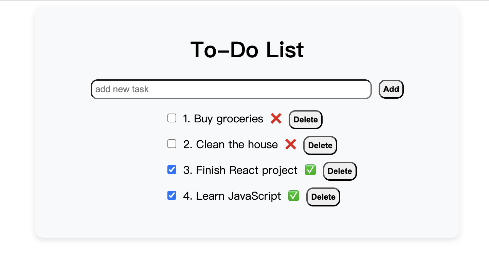

# ToDo List Application

A simple and interactive ToDo List application built with React and styled-components. This application allows users to add, mark, and delete tasks, helping them manage their daily activities efficiently.



## 📚Features

- Add new tasks with ease.
- Mark tasks as completed or pending.
- Delete tasks when they are no longer needed.
- Real-time UI updates for better user experience.
- Responsive design for different screen sizes.

## 🪓Technologies Used

- **React**: A JavaScript library for building user interfaces.
- **Styled-Components**: For styling the components using a CSS-in-JS approach.
- **JavaScript (ES6+)**: For building the core functionality of the app.
- **HTML5** and **CSS3**: For the structure and basic styling.

## 🔗Installation

Follow these steps to run the project locally:

1. **Clone the repository**:

   ```bash
   git clone https://github.com/yourusername/todo-list-app.git
   cd todo-list-app

   ```

2. **Navigate to the client directory**

   ```bash
   cd client

   ```

3. **Install Dependencies**

   ```bash
   npm install

   ```

4. **Start the development server**
   ```bash
   npm start
   ```

The application will run on http://localhost:3000.

## 🪄Usage

- Open the application in your browser.
- Use the input field to add new tasks.
- Mark tasks as completed by clicking on the checkbox.
- Delete tasks by clicking the delete button.
